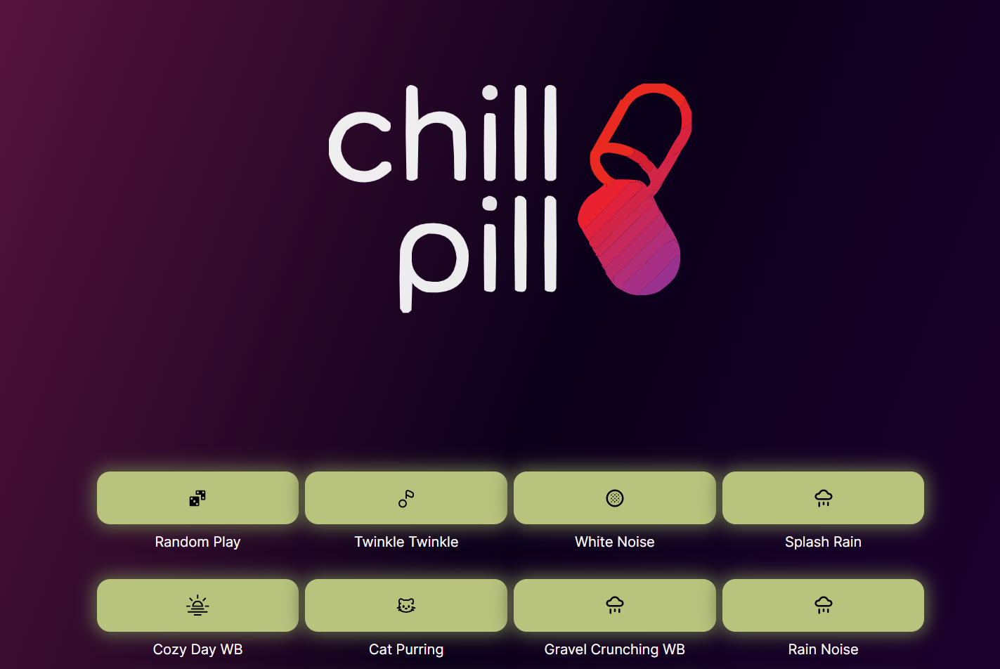

# CHILL PILL

# Live
- [chill-pill-mu.vercel.app/](https://chill-pill-mu.vercel.app/)
- [web-02.fluffycookie.tech/chillpill/](http://web-02.fluffycookie.tech/chillpill/)
# Authors
Noor Amjad - [GitHub](https://github.com/Justxd22) / [Twitter](https://twitter.com/_xd222)   
Amr Abdelfattah - [GitHub](https://github.com/0x3mr) / [Twitter](https://twitter.com/an0n_amr)  
Ahmed Shalaby - [GitHub](https://github.com/Madiocre) / [Twitter](https://twitter.com/)   
## What is Chill Pill
### Ditch Anxiety: Chill Pill to the Rescue!

Chill Pill was made with primarly focus on user expereince making sure sole focus on producitivty or finishing tasks or even help sleep! with over 100+ sounds from white noise to funny noises or even cat purrs to help relax and focus on improved productivty 

Chill Pill is meticulously crafted with a primary focus on enhancing user experience, ensuring that users can maintain productivity, complete tasks efficiently, and even improve their sleep quality. Featuring an over 100+ sounds, including white noise, Funny noises, and even soothing cat purrs, Chill Pill provides a diverse range of auditory experiences to help users relax, concentrate, and boost their productivity.

Our intuitive UI allows for seamless navigation, enabling users to quickly find and select the perfect sound for any situation With awesome hand picked Icons. Whether you're looking to drown out distractions, create a calm work environment, or wind down after a long day, Chill Pill has you covered.

Chill Pill is more than just a productivity tool—it's a comprehensive solution for enhancing focus, relaxation, and overall well-being. Discover the difference that a well-designed soundscape can make with Chill Pill!  
### [Go to Chill Pill!!!](#Live)
## File indexing and store
```py_stuff/index.py``` is indeed our indexing method to make and update our db stored in sound.json  
different sounds are in different categories like: Piano, Water, Rain  
```json
{
    "new_lullaby_003": {"name": "new_lullaby_003", "path": "sounds/new_lullaby_003.ogg", "desc": "piano", "category": "piano"}, 
    "whitenoise": {"name": "whitenoise", "path": "sounds/whitenoise.ogg", "desc": "plain noise", "category": "white"}, 
    "sound197": {"name": "sound197", "path": "sounds/sound197.ogg", "desc": "water drops", "category": "water"},
    "rain": {"name": "rain", "path": "sounds/rain.ogg", "desc": "rain", "category": "rain"}, 
    "sound194": {"name": "sound194", "path": "sounds/sound194.ogg", "desc": "rain on windows", "category": "rain"}, 
    "sound107": {"name": "sound107", "path": "sounds/sound107.ogg", "desc": "rain on car windows", "category": "rain"}
}
```


## UI/UX
- Using tailwind css   
  



## Framwork and backend
- using node Nextjs typescript
- Easier hot reloads
- fast compile times
- fast deploys
- modern enough to satisfy our dev needs like handling audio

# Installation / Running locally
- git clone
- make sure u have node 18 and npm installed
- run `npm install` on the project folder
- run the app `npm run dev`

## Deploying
- We're using `pm2` to run a compiled build
- `pm2` helps to run/stop/restart and also auto-start on failure due to app error or system shutdown  
- To restart `pm2 restart chillpill`
### Updating a deploy
- Git pull `git pull`
- make new build `npm run build`
- restart the app `pm2 restart chillpill`
### Steps to deploy from Zero to Hero
- First u make a new build with latest code using npm (do git pull if needed) `npm run build`
- Now if it builds without any errors u will have a new folder called `.next`
- Now we configure pm2 with `pm2 start npm --name "chillpill" -- start`
- now that pm2 registered your app you can see logs with `pm2 logs`
- now the app is running on localhost on port 3000 
- we need outside access that's why we are going to conguire nginx proxy
- our proxy will forward "web2.domain.com/chillpill" to "127.0.0.1:3000"
- We already have nginx installed just copy the config from `nginx.conf` to `/etc/nginx/sites-available/default`
- restart nginx with `sudo nginx -s reload`
- test ur app with ur domain


# License
    